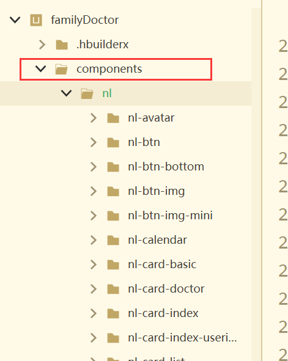
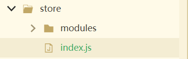

# uniapp基础语法

- uniapp它是建立在vue的框架基础之上，因此所有的语法都是使用的vue语法。
- uniapp的配置文件- mainfest.json， 用于配置uniapp打包的一些设置。
- uniapp的pages.json配置文件-全局配置文件，用于配置unaipp中的页面和样式。

## 1、定义变量

```js
data() {
    return {
        // #ifdef H5
        msg: '我是h5msg',
        // #endif
        // #ifdef MP
        msg: '我是小程序的变量',
        // #endif
        // #ifdef APP
        msg: '我是APP的变量',
        // #endif
        username: '张三',
        age: 3,
        isShow: false,
        objUser: {
            id: 1,
            name: '李四'
        },
        listUser: [
            {id:2, name: '麻子'},
            {id:3, name: '王五'}
        ]
    };
}
```

## 2 显示变量

- {{}}
- v-text

## 3 常用vue指令

- v-if
- v-show
- v-for, 小程序循环数字时item从0开始
- v-bind
- v-on
- v-model: 只能用于input框

## 4 计算属性、侦听器、过滤器

```js
//计算属性
computed: {
    total() {
        let result = 0;
        this.listGoods.forEach(item => {
            result = result + (item.count * item.price)
        })
        return result;
    }
}
// 侦听器
watch: {
    listGoods: {
        handler(nv, ov) {
            this.listGoods.forEach(item => {
                item.total = item.count * item.price;
            })
        },
            deep: true
    }
}
//过滤器
filters: {
    formartMoney(val) {
        if (val) {
            return String(val).replace(/(\d)(?=(\d{3})+$)/g, '$1,')
        }
    }
}
```


## 5 自定义组件

首先在项目根目录下定义components文件夹，再在components文件夹下定义一个组件包名称，比如 nl，然后自定义的组件都放在nl里面。在nl下新建页面，新建时必须同时生成同名文件夹，名称建议以 “nl-”开头。 新建的vue文件便是一个自己的自定义组件，此时可以使用vue的component进行注册使用。也可以在配置文件里面配置动态注册，动态注册规则为 components/nl 文件夹下  以"nl-" 开头的都进行注册

```bash
"easycom": {
    "autoscan": true,
    "custom": {
    "nl-(.*)": "@/components/nl/nl-$1/nl-$1.vue"
    }
}
```




# uniapp状态机

- 与vue类似

  

## 定义状态机

新建store文件夹，store下建立index,js

```js
import Vue from 'vue'
import Vuex from 'vuex'
Vue.use(Vuex)
// 子仓库
import residentModule from './modules/residentModule' ;// 

export default new Vuex.Store({
  // 定义数据
  state: {
		serveUrl:"http://127.0.0.1:3000/public/familyDoctor"

  },
  //计算属性, 用于获取state中的数据，它可以在获取数据时进行计算，把计算后的值返回
  //约定使用此方法暴露数据，不要直接操作数据
  getters: {
    // getName(state) {
    //   return state.desc + "版本号：7.0.1"
    // }
  },
  //同步方法：用于获取或是设置state中的数据
  // 约定使用该方法修改数据，不然vue无法监测数据变化
  //  约定方法名全大写
  mutations: {
    // ADD_COUNT(state, val) {
    //   state.count += val;
    // }
  },
  //异步方法：用于获取或是设置state中的数据，在actions中可以执行一些异步的任务，
  // 例如调用接口，setTimeout等
  actions: {

  },
  //用于定义子仓库的：模块化状态机
  modules: {
    residentModule
  }
})

```

子modules

```js
import {
	log
} from "util";

/******************************************************************************************
 *@Desc: 居民信息字段模型
 *@Author: Wanglei
 *@Date: 2023-06-07 09:28:11
 ******************************************************************************************
 */
export default {
	// 当模块被注册后，它的所有 getter、action 及 mutation 都会自动根据模块注册的路径调整命名
	namespaced: true,
	// 
	state: {
		// 当前居民信息
		residentInfo: {
			"id": "",
			"number": "20235111635112",
		},
		// 用户信息基础数据
		basicInfo: {
			password: {
				val: ""
			},
		}
	},
	//
	getters: {
		residentObj(state) {
			return state.residentInfo;
		},
		basicInfo(state) {
			return state.basicInfo;
		}
	},
	//
	mutations: {
		SET_RESIDENT(state, obj) {
			state.residentInfo = {
				...state.residentInfo,
				...obj
			};
		}
	},
}
```

## 使用状态机

- mixin

```js
// 导入主仓库的辅助函数
import {
	createNamespacedHelpers
} from 'vuex';
// 导入 userModule 子仓库的辅助函数
let {
	mapGetters: mapResidentGetters,
	mapMutations: mapResidentMutations,
	mapActions: mapResidentActions,
} = createNamespacedHelpers('residentModule');


export default {
	computed: {
		...mapResidentGetters(['residentObj', 'basicInfo']),
	},
	data() {
		return {}

	},
	methods: {
		...mapResidentMutations(['SET_RESIDENT']),
		formatById(id, name) {
			const arr = this.from[name].options.dataOrigin;
			const t = arr.find(item => item.id == id)
			return t.desc;
		}
	},
	onShow() {
		const App = getApp();
		// 根据id查询居民基本信息，标签以及健康档案
		if (!App.globalData.residentId) {
			return
		}
		this.$api.getResidentLabelHealthById({
			residentId: App.globalData.residentId,
		}).then(res => {
			this.SET_RESIDENT(res.data);
		})
	}
}
```

## 条件编译


## 语法

```
#ifdef：if defined 仅在某平台存在
#ifndef：if not defined 除了某平台均存在
%PLATFORM%：平台名称

```

%PLATFORM%  **可取值如下：**

```
#APP-PLUS	App
#APP-PLUS-NVUE或APP-NVUE	App nvue
#H5	H5
#MP-WEIXIN	微信小程序
#MP-ALIPAY	支付宝小程序
#MP-BAIDU	百度小程序
#MP-TOUTIAO	字节跳动小程序
#MP-LARK	飞书小程序
#MP-QQ	QQ小程序
#MP-KUAISHOU	快手小程序
#MP-JD	京东小程序
#MP-360	360小程序
#MP	微信小程序/支付宝小程序/百度小程序/字节跳动小程序/飞书小程序/QQ小程序/360小程序
#QUICKAPP-WEBVIEW	快应用通用(包含联盟、华为)
#QUICKAPP-WEBVIEW-UNION	快应用联盟
#QUICKAPP-WEBVIEW-HUAWEI	快应用华为

```

栗子

```
#ifdef APP-PLUS
需条件编译的代码
#endif
//仅出现在 App 平台下的代码

#ifndef H5
需条件编译的代码
#endif
//除了 H5 平台，其它平台均存在的代码

#ifdef H5 || MP-WEIXIN
需条件编译的代码
#endif
//在 H5 平台或微信小程序平台存在的代码（这里只有||，不可能出现&&，因为没有交集）
```


